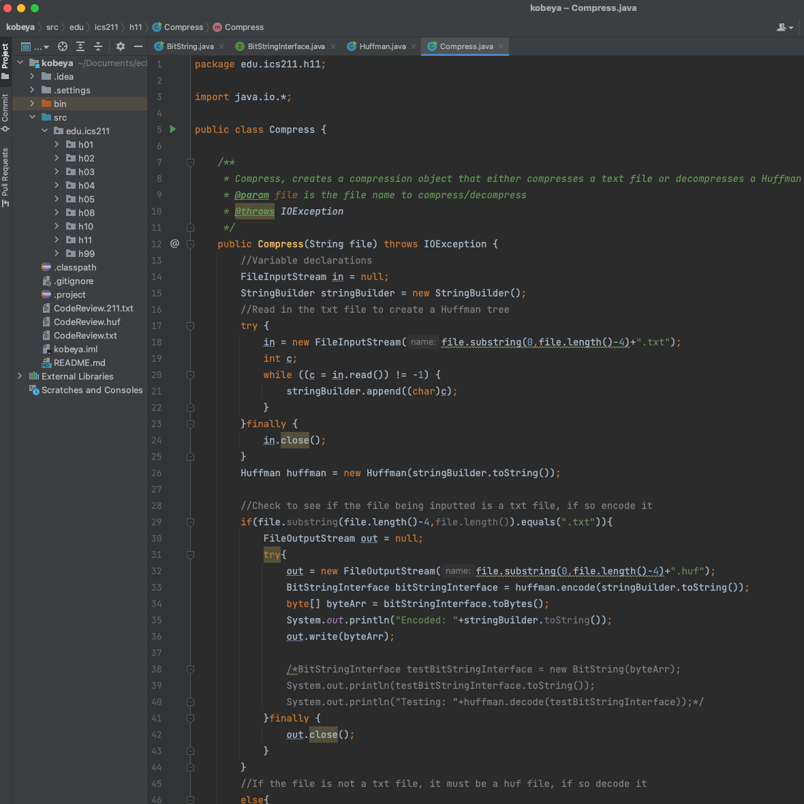

As a Student of the University of Hawaii College of Natural Sciences Computer Science I took ICS 211 durring the Fall 2021 semester taught by Professor Edoardo Biagioni. This is all the Homework assignments from that class. The overall theme of these homework assignments is to create the front end of a compiler. The Github repository is below for your viewing. 

Github Repository: <a href="https://github.com/Kobeyarai808/ICS211">https://github.com/Kobeyarai808/ICS211</a>

For any questions, comments, or concerns, please contact Kobey Arai at kobeya@hawaii.edu

Source of Image: <a href="https://github.com/Kobeyarai808/ICS211"><i class="large github icon "></i>Kobeyarai808/ICS211</a>

